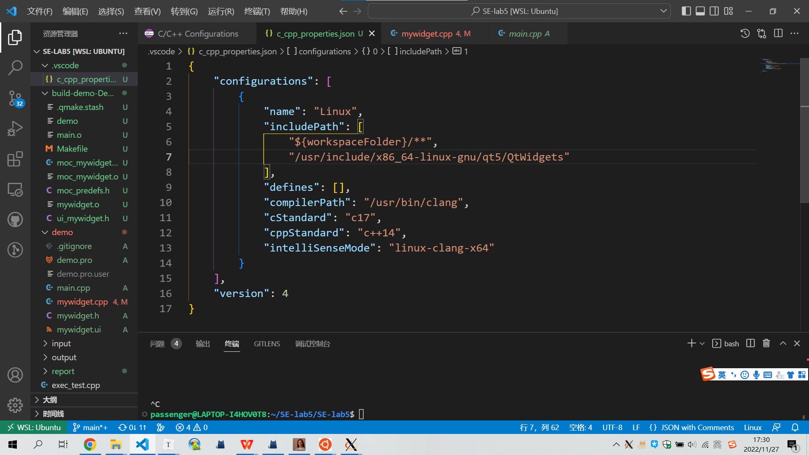
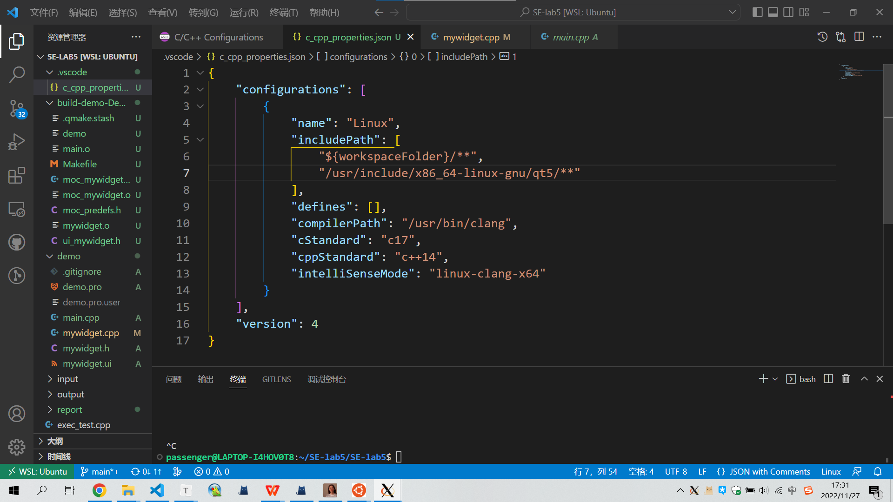
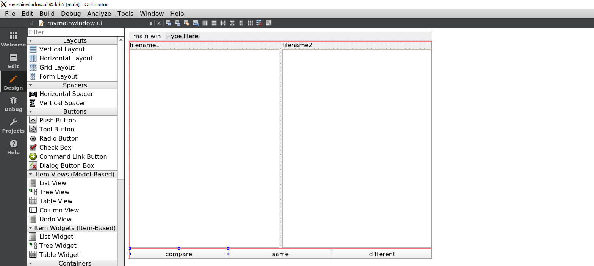
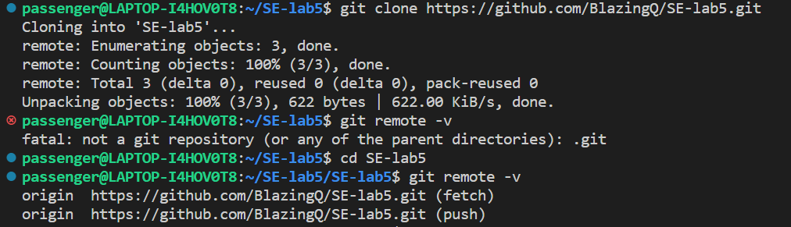
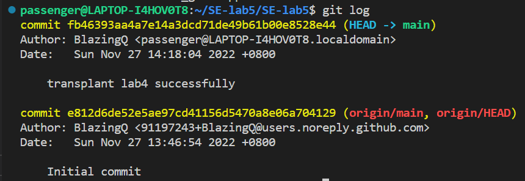
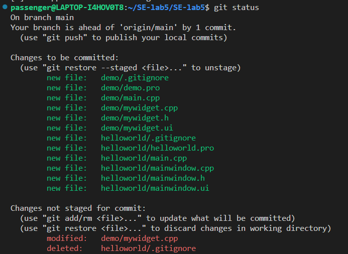
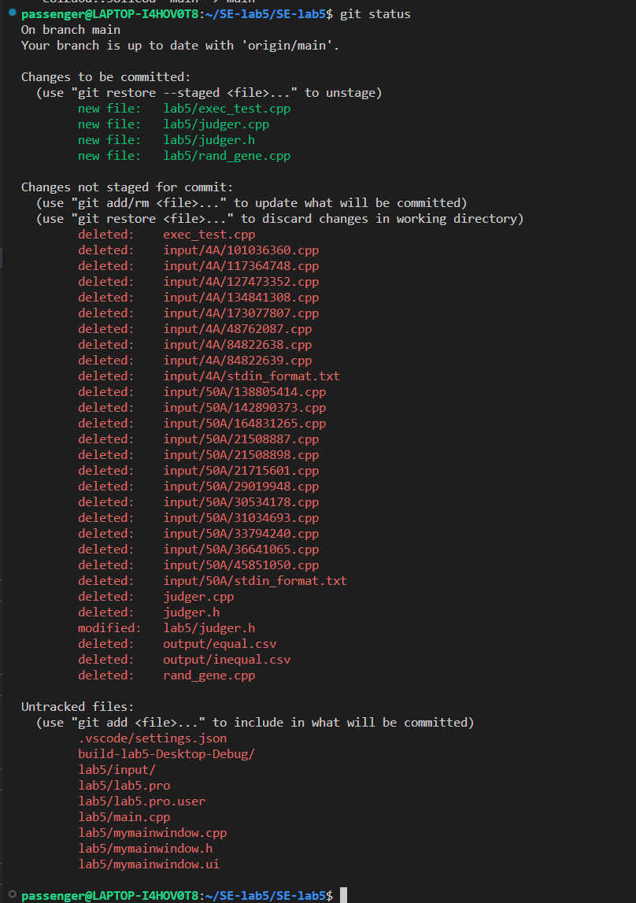
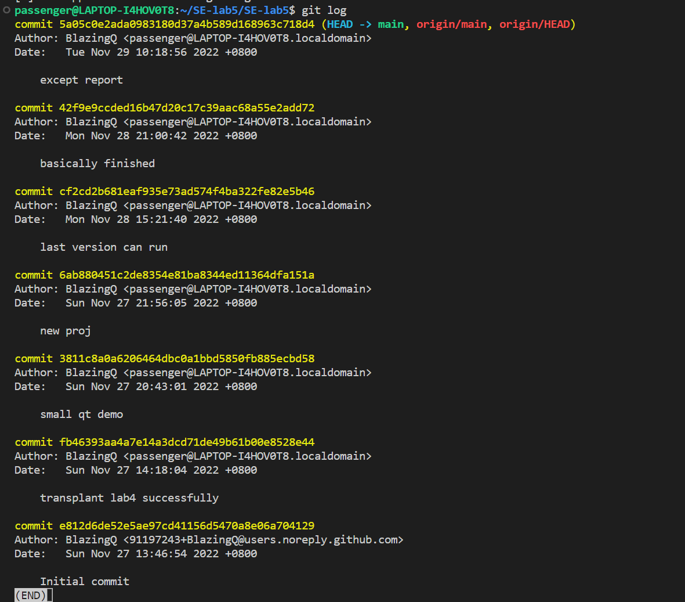

# LAB5-REPORT

201220051 钱子隽

**指导老师：张天 王豫**

2022.11.27

---

## 实验环境

lab4代码在wsl里面写的，不想再移植到windows上面了，同时也想试着配配环境，就在wsl里面搭qt写了。一些辛酸血泪写成md也传到远端仓库去了。

操作系统：wsl2

Xserver：Xming 2016开源版

qt：Qt Creator 4.11.0 based on Qt 5.12.8（好像是组件都是4.11的，但是我确实可以用qt5的一些特性）

## 程序代码

~~由于我没有选高程，整个oop的水平比较捉襟见肘，这次的函数都直接在qt创建的mainwindow里面写的。~~

首先是整体框架，lab5是在lab4的基础上进行开发的，程序运行后会先跑完lab4的代码，生成出.csv文件，再根据.csv文件获知需要人工比对的文件对（我只选择去查看equal.csv，默认inequal的不用再看了），之后程序的运行就是slot推动的了。

lab5主要实现了三个函数和三个slot：

```c++
public:
    myMainWindow(QWidget *parent = nullptr);
    ~myMainWindow();
    void gothrough();
    void getnext();
    void writeback();

private slots:
    void on_btnsame_clicked();
    void on_btndiff_clicked();
    void on_compare_clicked();
```

**gothrough()**

遍历.csv文件，将文件内容存到vector中，便于之后读取。同时显示第一个需要比对的文件。

```c++
void myMainWindow::gothrough()
{
    ifstream ifs("../lab5/output/equal.csv", ios::in);
    if(!ifs) 
    {
        cout<<"ERROR OPEN ../lab5/output/inequal.csv\n";
        return;
    }
    string temp;
    while(!ifs.eof())
    {
        ifs>>temp;
        if(temp != "file1,file2")
            filepairs.push_back(temp);
    }
    filepairs.pop_back();
    getnext();
}
```

**getnext()**

读取vector中的下一项并且pop。

根据读到的文件路径在ui界面加载内容。如果vector被读空了，就跳出弹窗表示读完了，并且将所有人工判定的结果写回到文件。

```c++
void myMainWindow::getnext()
{
    string temp;
    string file1, file2;
    string filetext1, filetext2;
    int commapos = -2;
    if(!filepairs.empty())
    {
        temp = filepairs.back();
        filepairs.pop_back();
        commapos = temp.find(',');
        file1 = temp.substr(0, commapos);
        file2 = temp.substr(commapos + 1, temp.size());
        ui->label->setText(QString::fromStdString(file1));
        ui->label_2->setText(QString::fromStdString(file2));
        filetext1 = tmpjudger.ftos(file1);
        filetext2 = tmpjudger.ftos(file2);
        ui->textEdit1->setText(QString::fromStdString(filetext1));
        ui->textEdit2->setText(QString::fromStdString(filetext2));
    }
    else
    {
        QMessageBox::information(this," ","You have done all!!");
        writeback();
        ui->label->setText("");
        ui->label_2->setText("");
        ui->textEdit1->setText("");
        ui->textEdit2->setText("");
    }
}
```

**writeback（）**

写回的过程，遍历临时的vector写回到相应的文件。

```c++
void myMainWindow::writeback()
{
    ofstream ofs("../lab5/output/equal.csv", ios::out);
    if(!ofs) 
    {
        cout<<"ERROR OPEN ../lab5/output/equal.csv\n";
        return;
    }
    for(int i = 0; i != equalpairs.size(); ++i)
    {
        ofs<<equalpairs[i]<<"\n";
    }
    ofs.close();
    ofs.open("../lab5/output/inequal.csv", ios::out);
    if(!ofs) 
    {
        cout<<"ERROR OPEN ../lab5/output/inequal.csv\n";
        return;
    }
    for(int i = 0; i != inequalpairs.size(); ++i)
    {
        ofs<<inequalpairs[i]<<"\n";
    }
    ofs.close();
}
```

**void on_btnsame_clicked();**
**void on_btndiff_clicked();**

调用getnext显示下一个文件对，同时通过读取ui界面的信息得到当前的文件路径，根据用户的判断存到对应的vector中，待将来写入文件。

```c++
void myMainWindow::on_btnsame_clicked()
{
    string file1, file2;
    file1 = ui->label->text().toStdString();
    file2 = ui->label_2->text().toStdString();
    if(file1.compare("") != 0)
        equalpairs.push_back(file1+","+file2);
    getnext();
}
```

### 遇到问题与解决方法

- qt编译过程会把可执行文件放到另一个文件夹下，会导致原本lab4的路径失效，需要重新设置

- vscode本来的include path存在问题，无法读到qt的头文件库。后来在c_cpp_properties.json中修改设置才能正确解析



需要将其修改为下图：



### 拓展

**on_compare_clicked()**

比较简单的实现，逐字符比对。最后再统一调整ui界面的颜色。调整颜色使用了Qcolor和Qtextcursor，添加的背景色。

```c++
void myMainWindow::on_compare_clicked()
{
    QByteArray text1 = (ui->textEdit1->toPlainText()).toUtf8();
    QByteArray text2 = (ui->textEdit2->toPlainText()).toUtf8();
    QList<int> differenceList;
    int larger = 0;
    bool oneIsBig = false;
    bool twoIsBig = false;
    if(text1.length() > text2.length())
    {
        twoIsBig = false;
        oneIsBig = true;
        larger = text1.length();
    }

    if(text1.length() < text2.length())
    {
        twoIsBig = true;
        oneIsBig = false;
        larger = text2.length();
    }

    if(text1.length() == text2.length())
    {
        twoIsBig = false;
        oneIsBig = false;
        larger = text1.length();
    }

    if(oneIsBig == true)
    {
        for(int i = text2.length(); i < text1.length();i++)
        {
            text2.append(' ');
        }
    }
    if(twoIsBig == true)
    {
        for(int i = text1.length(); i < text2.length();i++)
        {
            text1.append(' ');
        }
    }

    ui->textEdit1->setText(text1);
    ui->textEdit2->setText(text2);

    for(int i = 0; i < larger; i++)
    {
        if(text1[i] != text2[i])
        {
            differenceList.append(i);
        }
    }

    QTextCursor cursorText1(ui->textEdit1->document());
    QTextCursor cursorText2(ui->textEdit2->document());
    m_txtBox1Color.setRgb(153,255,255);
    m_txtBox2Color.setRgb(255,255,153);

    QTextCharFormat backgroundClear, background1, background2;
    backgroundClear.clearBackground();
    background1.setBackground(m_txtBox1Color);
    background2.setBackground(m_txtBox2Color);

    cursorText1.setPosition(QTextCursor::Start,QTextCursor::MoveAnchor);
    cursorText1.setPosition(QTextCursor::End,QTextCursor::KeepAnchor);
    cursorText1.setCharFormat(backgroundClear);
    cursorText2.setPosition(QTextCursor::Start,QTextCursor::MoveAnchor);
    cursorText2.setPosition(QTextCursor::End,QTextCursor::KeepAnchor);
    cursorText2.setCharFormat(backgroundClear);

    for(int i = 0;i < differenceList.size();i++)
    {
        cursorText1.setPosition(differenceList[i],QTextCursor::MoveAnchor);
        cursorText1.setPosition(differenceList[i] + 1,QTextCursor::KeepAnchor);
        cursorText1.setCharFormat(background1);

        cursorText2.setPosition(differenceList[i],QTextCursor::MoveAnchor);
        cursorText2.setPosition(differenceList[i] + 1,QTextCursor::KeepAnchor);
        cursorText2.setCharFormat(background2);
    }
}
```

---

## UI界面



用layout排版布局。一共三层。

最上面是label，显示文件的路径。

中间是textedit，显示cpp文件的代码

最下面是三个按钮，compare是对文本框中的内容进行比较，same和different是用户的判断结果，调用的slot在前面说明了。

## GIT部分

先创建远端仓库，之后用git clone [url]：



用git remote -v查看，可以发现远端仓库的连接已经建立了。

之后将lab4的代码移植过来，由于还是在wsl之下写的，所以很轻松做到。git add，git commit先存档：



先学了会QT，写了点demo。但是我.gitignore写晚了，即是加进去了还是tracked了：



创建新的QT项目lab5，之后将lab4的代码文件移动到该文件夹下，git status查看：



可以注意到被移动的文件会同时被跟踪为new file和deleted，同时新建的和lab5相关的qt文件都是untracked。

最后是整个的开发过程：



### 扩展

远端仓库：https://github.com/BlazingQ/SE-lab5